<div align="center">
    
</div>


# Intro
Setup to run Ollama in docker.\
Ollama is a free, open-source platform that lets you download, manage, and run large language models (LLMs) directly on your own computer.


# Prerequisites
* Ubuntu 26.04
* docker
* docker compose


# To lauch
```
bash ./up.sh
```


# To shutdown
```
bash ./down.sh
```


# Web services
## Open WebUI
[localhost:3531](http://localhost:3531)


# Initial start
Upon 1st startup have to create user account:
<div align="center">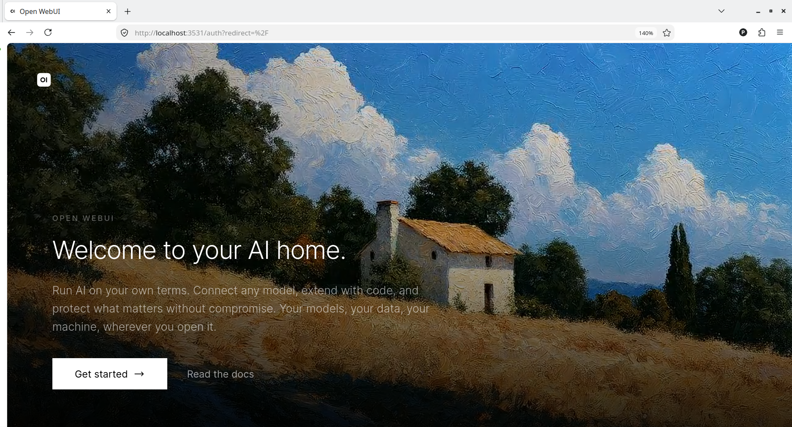</div>
<div align="center">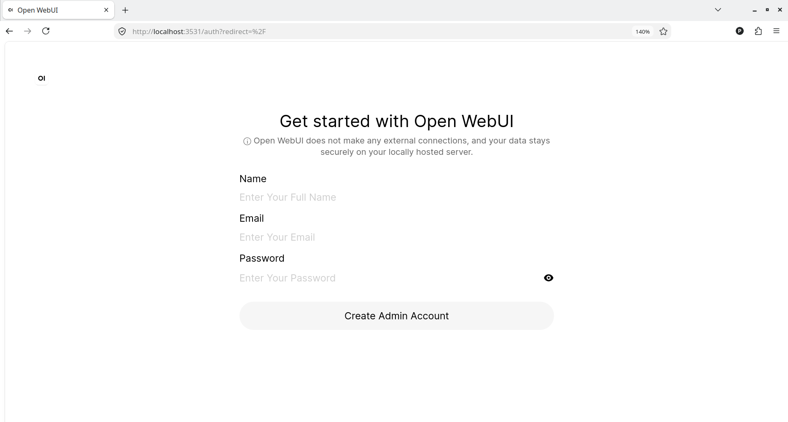</div>
<div align="center">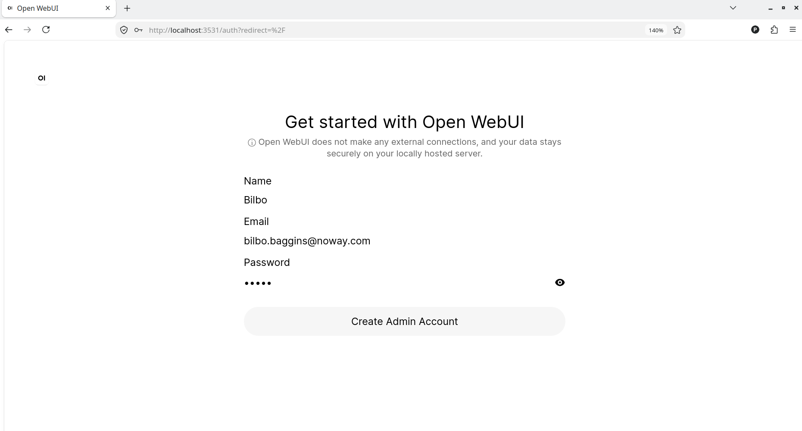</div>
<div align="center">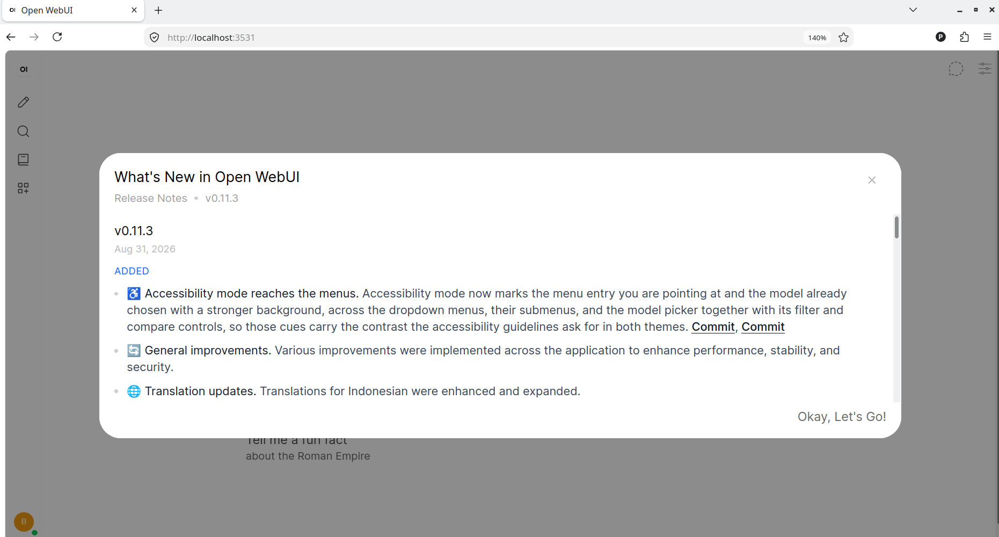</div>
<div align="center">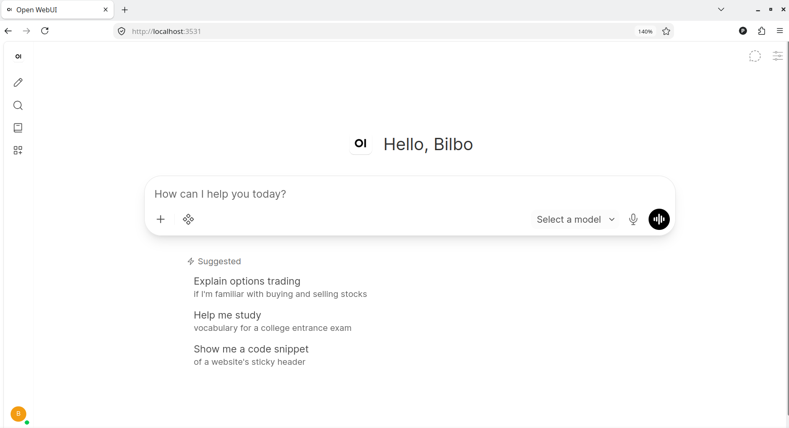</div>


# Downloading models
Next step to download desired model, ket it be very basic llama3.2:
<div align="center">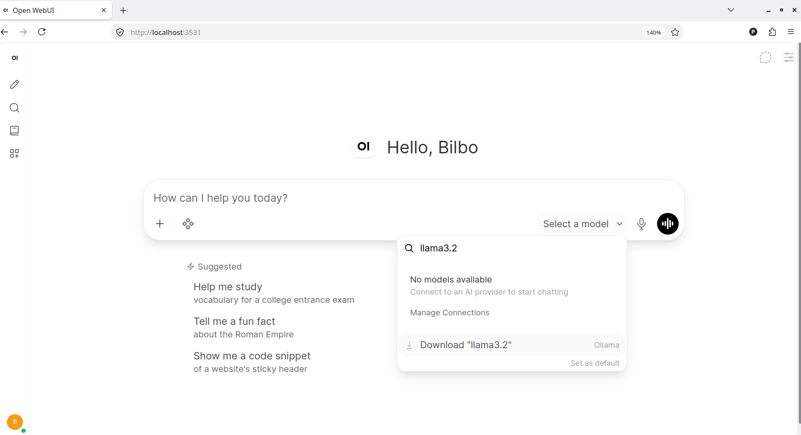</div>
<div align="center">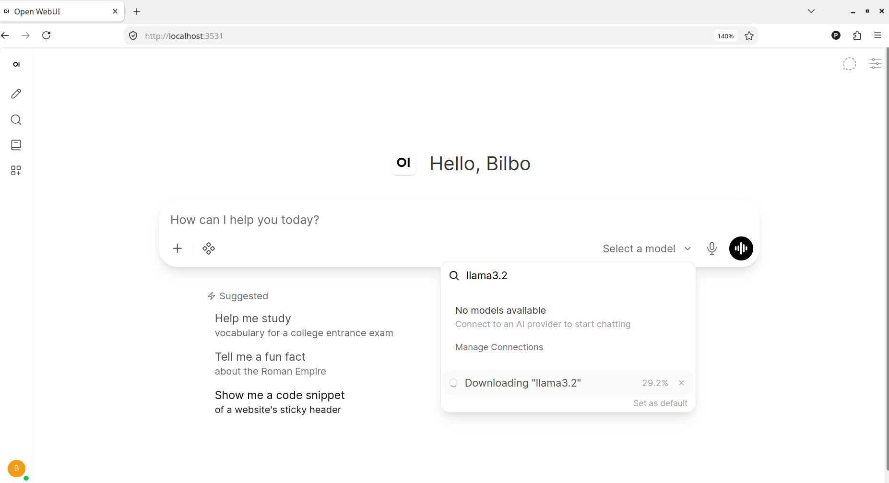</div>


# Quick test for llama3.2
Lets make basic test - language cards.\
Prompt:
```
Hello
Let make language cards for English and Russian languages.
Please:
* choose 10 most used English verbs, translate to Russian and print these ones like [English == Russian]
* choose 10 most used English nouns, translate to Russian and print these ones like [English == Russian]
* Make 30 example sentences utilizing these verbs and nouns, translate to Russian and print like [English == Russian]
```

Result:
<div align="center">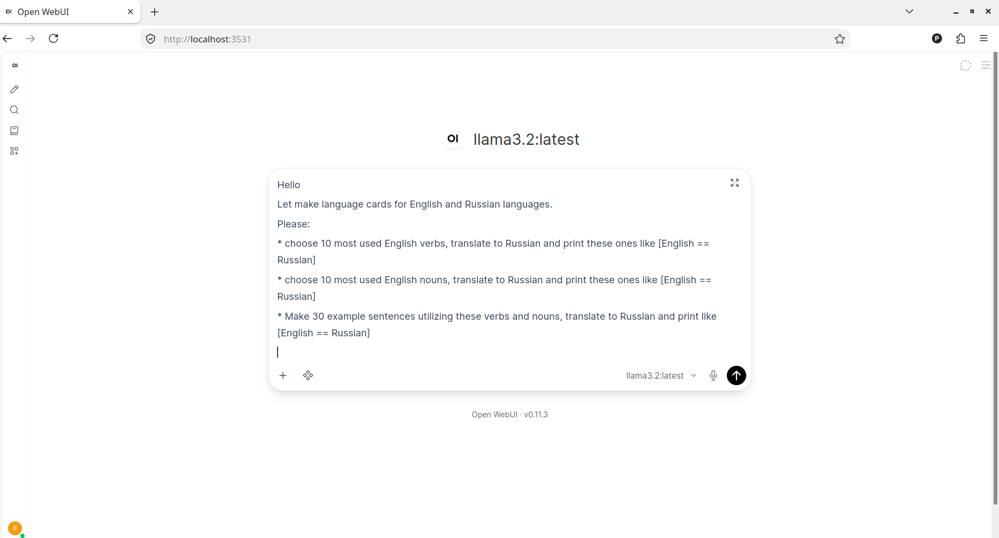</div>
<div align="center">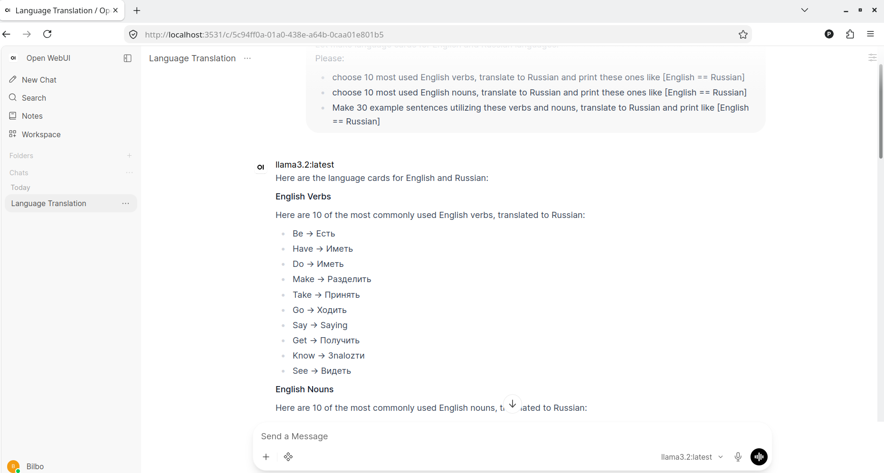</div>
<div align="center">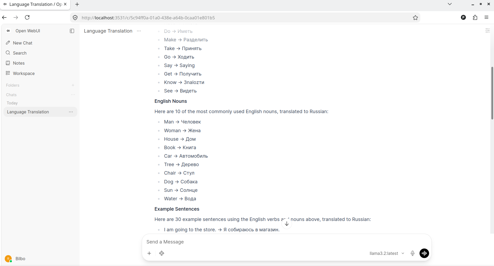</div>
<div align="center">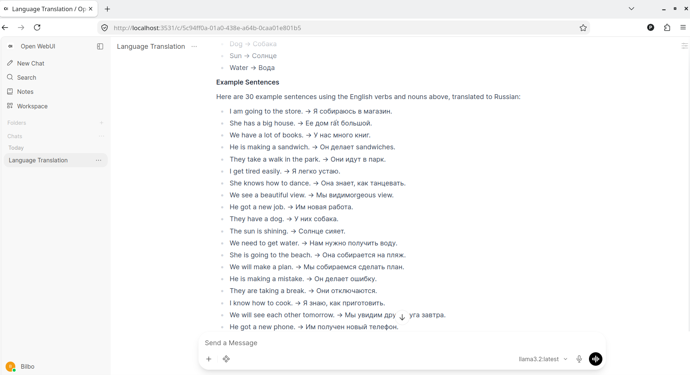</div>


# LLM models location
LLM models a stored into volumes.\
Volumes are created upon 1st startup.\
To list LLM volumes:
```
docker volume ls | grep llm_ollama_docker
```
Two volumes shall be reported:
```
local     llm_ollama_docker_ollama_data
local     llm_ollama_docker_open_webui_data
```
Then inspect any of these volumes to find file system location:


## Inspect Open WebUI volume
```
docker volume inspect llm_ollama_docker_open_webui_data 
```
result:
```
[
    {
        "CreatedAt": "2026-09-14T21:02:58+03:00",
        "Driver": "local",
        "Labels": {
            "com.docker.compose.config-hash": "ba3a61e1313fe14c9904d9d69d3aa95623ebef220c4eb6756e7e5b2c40b40e0f",
            "com.docker.compose.project": "llm_ollama_docker",
            "com.docker.compose.version": "2.39.1",
            "com.docker.compose.volume": "open_webui_data"
        },
        "Mountpoint": "/var/lib/docker/volumes/llm_ollama_docker_open_webui_data/_data",
        "Name": "llm_ollama_docker_open_webui_data",
        "Options": null,
        "Scope": "local"
    }
]
```
Inspect volume disk size:
```
sudo du -hs /var/lib/docker/volumes/llm_ollama_docker_open_webui_data/
```
result:
```
1.1G    /var/lib/docker/volumes/llm_ollama_docker_open_webui_data/
```


## Inspect Ollama volume
```
docker volume inspect llm_ollama_docker_ollama_data
```
result:
```
[
    {
        "CreatedAt": "2026-09-14T21:02:58+03:00",
        "Driver": "local",
        "Labels": {
            "com.docker.compose.config-hash": "5593a8fd06b70ea7724e40f37710da25fc300ae73f149362c947689778d78f59",
            "com.docker.compose.project": "llm_ollama_docker",
            "com.docker.compose.version": "2.39.1",
            "com.docker.compose.volume": "ollama_data"
        },
        "Mountpoint": "/var/lib/docker/volumes/llm_ollama_docker_ollama_data/_data",
        "Name": "llm_ollama_docker_ollama_data",
        "Options": null,
        "Scope": "local"
    }
]

Inspect volume disk size:
```
sudo du -hs /var/lib/docker/volumes/llm_ollama_docker_ollama_data
```
result:
```
1.9G    /var/lib/docker/volumes/llm_ollama_docker_ollama_data
```
This result is for only llama3.2 installed.\
For empty(initial setup) that volume was 32 KBs only.
